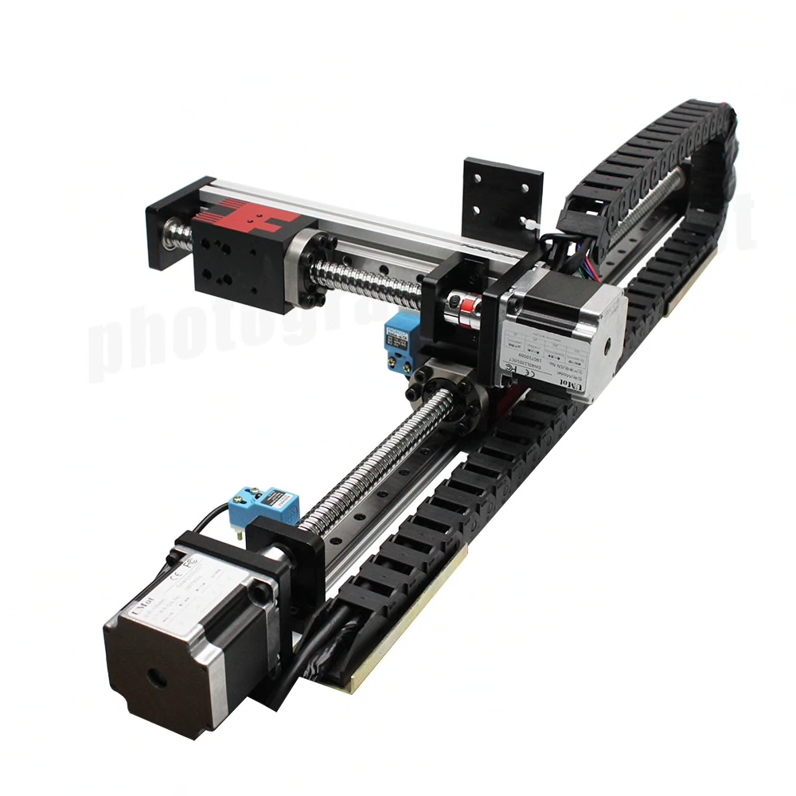

# Etude de la robustesse d'un asservissement visuel 2D

## Objectifs de la séance
L’intérêt de l’asservissement visuel 2D vient de l’expression de la tâche qui se fait directement dans l’image. Ceci permet d’éviter les erreurs de reconstruction de pose rencontrées dans l’asservissement visuel 3D. 

La mise en œuvre d’asservissement visuel 2D requiert néanmoins la  connaissance des paramètres intrinsèques et extrinsèques de la caméra. L’objectif de cette séance est d’étudier l’influence d’une erreur d’estimation de ces paramètres sur la stabilité et la performance de l’asservissement.

## Environnement de travail
Le travail se fera en simulation au sein d'un environnement de développement Python.

Nous allons considérer un robot plan cartésien à deux degrés de liberté comme celui représenté par la figure \ref{fig:robot_cart}. Une caméra est montée sur l’organe terminal du robot.  La caméra se déplace parallèlement à un plan contenant une cible, constituée d’un point. La distance entre le plan de la cible et l’image est égale à d = 40 cm. 

Les paramètres intrinsèques de la caméra sont :
-  La focale : $f$ = 20 mm
- \item La taille d’un pixel : $k_x$ = 10 micromètres et $k_y$ = 10 micromètres
\end{itemize}

L'origine du repère de la caméra $C$ est considéré confondu avec celui de l’organe terminal du robot $O_n$. La matrice de Rotation du repère $R_c$ (repère de la caméra) vers $R_n$ (repère de l'organe terminal) est notée $R_{cn}$. Les axes de $R_n$ parallèles à ceux du repère de la base du robot $R_0$.

Les axes du robot cartésien simulé sont asservis en vitesse. La sortie de la loi de commande par vision sera donc un vecteur de consignes de vitesses articulaires.

Le code d’asservissement que vous allez devoir compléter se trouve dans le script «main.py».

Afin de vous familiariser avec ce script, commencez par le lancer. En faisant cela, une fenêtre de saisie apparaîtra. Dans cette fenêtre, vous pouvez saisir les paramètres estimés suivants : 

- L’angle de rotation estimé selon l’axe optique entre la caméra et l’organe terminal du robot ($\phi_e$)
- La distance focale estimée ($f_e$)
- Les dimensions estimés d’un pixel ($k_{xe}\times k_{ye}$ )
- La distance estimée entre le plan image et la cible ($d_e$)
- Le gain choisi pour l’asservissement visuel ($\lambda$)

Veuillez noter que les paramètres réels du robot ne finissent pas par $_e$. Ils sont différents de ceux que l'on va estimer et qui finissent par $_e$.

Dans un premier temps, ne modifiez pas les paramètres déjà saisis, qui correspondent à une estimation parfaite et définissent la « vérité terrain ». 

Comme l’asservissement rien ne se passera même si vous utilisez l'interface qui apparaîtra pour définir la consigne dans l'image.

## Travail à effectuer

### Travail préliminaire de modélisation

1. Tracer le schéma bloc d’un asservissement visuel 3D et celui d’un asservissement visuel 2D

2. Sachant que nous considérons un robot plan cartésien, quelles sont les variables du torseur cinématique $^{0}{\cal T}_{n/0}^{On}$, de l’effecteur du robot par rapport au repère monde $R_0$ et exprimé au centre de l’effecteur $O_n$ que nous allons contrôler ? 

3. Donner la relation reliant la variation reliant les vitesses en pixels/s d’un point de l’image à la variation du torseur cinématique  $^{C}{\cal T}_{c/0}^{C}$ de la caméra par rapport au repère monde $R_0$ et exprimé au centre de la caméra $C$

4. En considérant notre cadre d'étude, donner la matrice d'interaction en utilisant les paramètres définis plus haut dans le texte

5. En considérant maintenant les paramètres estimés, donner l'expression de la loi de commande par vision $\widetilde{^{C}{\cal T}_{c/0}^{C}}$ en fonction de l'erreur dans l'image

6. Au final nous allons contrôler 

$$
^{0}{\cal T}_{n/0}^{On}
$$

Exprimer ce torseur de vitesse en prenant en compte les hypothèses simplificatrices.

7. Donner la formule du vecteur de consignes de vitesses articulaires à envoyer aux variateurs des axes du robot.

8. Ecrire l'équation différentielle régissant l'évolution de l'erreur image en boucle fermée. `

### Implémentation de la loi de commande

Lire le code présent dans le script « main.py » pour appréhender sa structure et concentrez vous sur les parties que vous allez devoir compléter.

Ecrire la loi de commande et tester le bon fonctionnement du code.

### Simulation en cas d'estimation parfaite de tous les paramètres

Lors de vos simulations, il faut saisir les paramètres estimés exacts  (ou laisser les paramètres saisis par défaut). 

1. Lancer deux simulations avec deux valeurs différentes de $\lambda$. Pour chacune de ces deux simulation mesurer la constante de temps
de la réponse du système.

2. Vérifier les constantes de temps obtenues à celles qui peuvent être déduites du travail préliminaire de modélisation. Pour cela, commencer
à simplifier l'équation de la boucle fermée et déduire la constante de temps.

### Simulation de l'effet d’une erreur sur les paramètres intrinsèques
1. Saisir une valeur de la distance focale divisée par 2 tout en gardant les valeurs exactes des autres paramètres. Mesurer la constante de temps de la réponse et  justifier votre mesure en utilisant l'étude préliminaire.

2. Saisir une valeur de la distance entre la caméra et le plan contenant la cible est multipliée par 2 tout en gardant les valeurs exactes des autres paramètres. Mesurer la constante de temps de la réponse et justifier votre mesure en utilisant l'étude préliminaire.

3. En gardant tous les estimations à leurs valeurs exactes, et un gain $\lambda$ constant, effectuer deux simulations  en modifiant tour à tour
les valeurs de $k_{xe}$ et $k_{ye}$.  Mesurer la constante de temps de la réponse et justifier votre mesure en utilisant l'étude préliminaire.
\end{enumerate}

### Simulation de l'effet d’une erreur sur les paramètres extrinsèques
Dans cette partie, nous utiliserons les valeurs exactes des paramètres intrinsèques estimés. Nous utiliserons un gain $\lambda=5$.

Nous allons de plus considérer que la valeur exacte de $R_ {cn}$ est $\mathbb{I}_ 2$. Pour $\widehat{R_ {nc}}$, nous considérerons un décalage d'un angle $\phi$ autour de l'axe $\vec{z_n}$.

1. Fixer successivement la valeur de $\phi$ à 15, 40 et 70 degrés.
2. Observer et commenter le comportement de l'asservissement visuel. Tracer un schéma en 2D expliquant ce que vous remarquez.
3. Choisir la position désirée du point de l’image à environ (0,0) et mettez $\phi$ à 90°. 
4. Observer et commenter le comportement de l'asservissement visuel. 
5. En reprenant et simplifiant la partie modélisation, donner la condition de convergence de l'asservissement visuel en fonction de $\phi$. 

